# JVM

## 内存区域与内存溢出异常

### 运行时数据区域

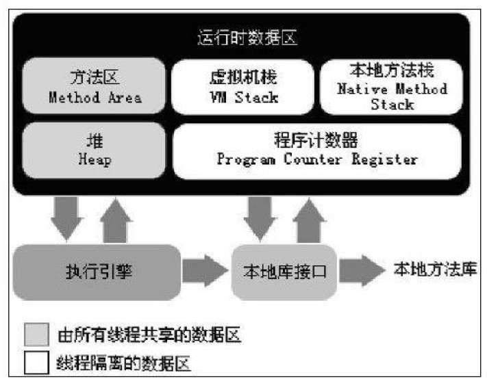

* 程序计数器

  通过改变这个计数器的值来选取下一条需要执行的字节码指令。

  每条线程都需要有一个独立的程序计数器。

* JVM栈

  JVM栈是线程私有的。

  虚拟机栈描述的是Java方法执行的内存模型：每个方法在执行的同时都会创建一个**栈帧**用于<u>存储局部变量表</u>、<u>操作数栈</u>、<u>动态链接</u>、<u>方法出口</u>等信息。每一个方法从调用直至执行完成的过程，就对应着一个栈帧在虚拟机栈中入栈到出
  栈的过程。

  局部变量表存放了编译期可知的各种基本数据类型、对象引用和returnAddress类型（指向了一条字节码指令的地址）。

  StackOverflowError异常:线程请求的栈深度大于虚拟机所允许的深度.

  OutOfMemoryError异常:虚拟机栈扩展时无法申请到足够的内存.

* 本地方法栈

  本地方法栈则为虚拟机使用到的Native方法服务.

* 堆

  Java堆是被所有线程共享的一块内存区域。

  所有的对象实例以及数组都要在堆上分配[。

* 方法区

  各个线程共享的内存区域。

  用于存储已被虚拟机加载的类信息、常量、静态变量、即时编译器编译后的代码等数据。

* 运行时常量池

  <u>运行时常量池（Runtime Constant Pool）是方法区的一部分。</u>

  Class文件中除了有类的版本、字段、方法、接口等描述信息外，还有一项信息是常量池（Constant Pool Table），用于存放编译期生成的各种字面量和符号引用，这部分内容将在类加载后进入方法区的运行时常量池中存放。

### 虚拟机对象

* 对象的创建

  1. 检查new指令的参数是否能在常量池中定位到一个类的符号引用，并且检查这个符号引用代表的类是否已被加载、解析和初始化过。如果没有，那必须先执行相应的类加载过程。
  2. 在类加载检查通过后，虚拟机将为新生对象分配内存。
  3. 将分配到的内存空间都初始化为零值。
  4. 设置对象头(对象是哪个类的实例、如何才能找到类的元数据信息、对象的哈希码、对象的GC分代年龄等信息)。
  5. 执行＜init＞方法。

* 对象的内存布局

  对象在内存中存储的布局可以分为3块区域：<u>对象头</u>（Header）、<u>实例数据</u>（Instance Data）和对齐填充。

  **对象头**包括两部分信息，第一部分用于存储对象自身的运行时数据，如哈希码（HashCode）、GC分代年龄、锁状态标志、线程持有的锁、偏向线程ID、偏向时间戳等;对象头的另外一部分是类型指针，即对象指向它的类元数据的指针，虚拟机通过这个指针来确定这个对象是哪个类的实例。如果对象是一个Java数组，那在对象头中还必须有一块用于记录数组长度的数据。

  **实例数据**部分是对象真正存储的有效信息，也是在程序代码中所定义的各种类型的字段内容。

* 对象的访问定位

  程序需要通过栈上的reference数据来操作堆上的具体对象。

  **句柄访问**：Java堆中将会划分出一块内存来作为句柄池，reference中存储的就是对象的句柄地址，而句柄中包含了对象实例数据与类型数据各自的具体地址信息。

  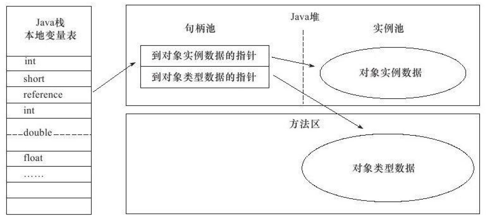

  **指针访问**：reference中存储的直接就是对象地址。

  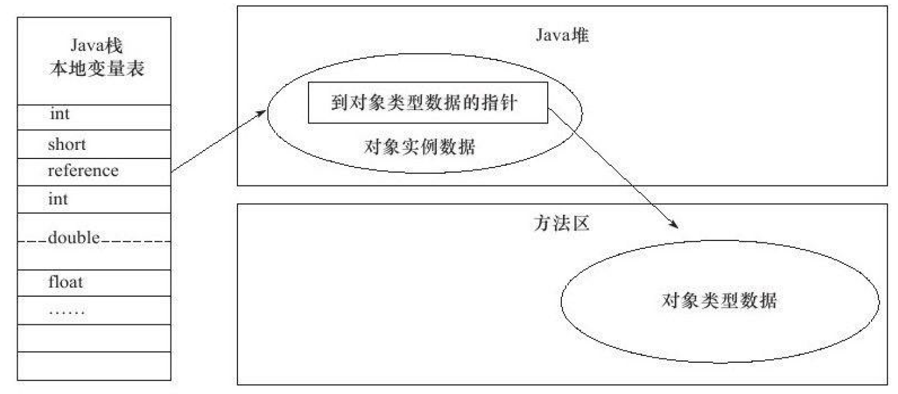

## GC

### 可达性分析算法

* 基本思路

  通过一系列的称为“GC Roots”的对象作为起始点，从这些节点开始向下搜索，搜索所走过的路径称为引用链（Reference Chain），当一个对象到GC Roots没有任何引用链相连时，则证明此对象是不可用的。

* 可作为GC Roots的对象

  虚拟机栈（栈帧中的本地变量表）中引用的对象。

  方法区中类静态属性引用的对象。

  方法区中常量引用的对象。

  本地方法栈中JNI（即一般说的Native方法）引用的对象。

### 引用

* 强引用

* 软引用

  在系统将要发生内存溢出异常之前，将会把这些对象列进回收范围之中进行第二次回收。

* 弱引用

  被弱引用关联的对象只能生存到下一次垃圾收集发生之前。

* 虚引用

  为一个对象设置虚引用关联的唯一目的就是能在这个对象被收集器回收时收到一个系统通知。

  一个对象是否有虚引用的存在，完全不会对其生存时间构成影响，也无法通过虚引用来取得一个对象实例。

### 回收对象

1. 判断是否有与GC Roots相连的引用链。

2. 判断此对象的finalize方法是否有必要执行。

   一个对象的finalize 方法只会执行一次。

### 回收方法区 

* 回收常量条件

  无任何引用时回收

* 回收废弃类条件

  1. 该类所有的实例都已经被回收。
  2. 加载该类的ClassLoader已经被回收。
  3. 该类对应的java.lang.Class对象没有在任何地方被引用。

### 垃圾收集算法

* 标记-清除算法

* 复制算法

  将内存分为两块，每次只使用其中的一块，当这一块的内存用完了，就将还存活着的对象复制到另外一块上面，，然后再把已使用过的内存空间一次清理掉。

* 标记-整理算法

  让所有存活的对象都向一端移动，然后直接清理掉端边界以外的内存。

* 分代收集算法

  在新生代中使用复制算法，在老年代中使用标记-清除算法或标记-整理算法。

精确式GC与保守式GC

* 精确式GC：回收过程中能准确的识别和回收每一个无用对象，为了准确识别每一个对象的引用，通常要求一些额外的数据。
* 保守式GC：不能准确的识别每一个无用对象。

### HotSpot的算法实现

* 枚举根节点

  可达性分析产生GC停顿。

  使用OopMap的数据结构得知对象引用的存放位置。

  因为使用准确式GC，故而不需要检查完所有执行上下文和全局的引用位置。

* 安全点(进入GC的点)

  抢险式中断：首先把所有线程全部中断，如果发现有线程中断的地方不在安全点上，就恢复线程，让它“跑”到安全点上。

  主动式中断：设置一个标志，各个线程执行时主动去轮询这个标志，发现中断标志为真时就自己中断挂起。轮询标志的地方和安全点是重合的。

* 安全区域

  代码段中引用关系不会发生变化的区域。

### 垃圾收集器

* Serial收集器

  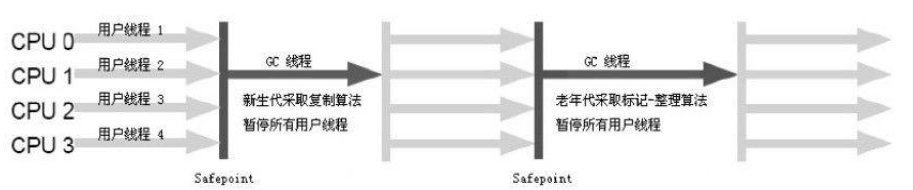

* ParNew收集器

  Serial收集器的多线程版本。

* Parallel Scavenge收集器

  吞吐量优先的ParNew收集器，能够自适应调节分代比例等参数以获取最大的吞吐量。是复制算法使用的收集器。

* CMS收集器

  基于标记-清除算法实现。

  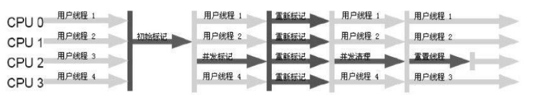

  * 初始标记:标记GC Roots能直接关联到的对象.
  * 并发标记:进行GC RootsTracing的过程.
  * 重新标记:修正并发标记期间因用户程序继续运作而导致标记产生变动的那一部分对象的标记记录.

  缺点：

  1. 增大CPU负荷，占用线程，导致应用程序运行变慢。
  2. 无法处理"浮动垃圾"，必须预留内存供用户线程使用。
  3. 可能导致大量空间碎片。

* G1

  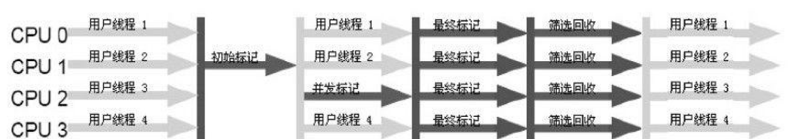

### 内存分配与回收策略

* 对象优先分配在新生代的Eden区

* 大对象直接进入老年代

* 长期存活的对象将进入老年代

  对象在Eden区中经历第一次Minor GC，将被移动到Survivor区中，并将年龄设置为1，之后每经历一次Minor GC，年龄加1。

* 动态的对象年龄判定

  如果在Survivor空间中相同年龄所有对象大小的总和大于Survivor空间的一半，年龄大于或等于该年龄的对象就可以直接进入老年代。

* 空间分配担保

  在发生Minor GC之前，虚拟机会先检查老年代最大可用的连续空间是否大于新生代所有对象总空间。

  当出现大量对象在Minor GC后仍然存活的情况（最极端的情况就是内存回收后新生代中所有对象都存活），就需要
  老年代进行分配担保，把Survivor无法容纳的对象直接进入老年代。

## 类文件结构

### 无关性

JVM提供的语言无关性支持。JVM只关心class文件，不关心来源于何种语言。

### 类文件结构

* 魔数与Class文件的版本(前8个字节)

* 常量池

  常量池中主要存放两大类常量：字面量（Literal）和符号引用（Symbolic References）。字面量如文本字符串、声明为final的常量值等，符号引用包括类和接口的全限定名（Fully Qualified Name）字段的名称和描述符（Descriptor）方法的名称和描述符。

  在Class文件中不会保存各个方法、字段的最终内存布局信息，因此这些字段、方法的符号引用不经过运行期转换的		  话无法得到真正的内存入口地址，也就无法直接被虚拟机使用。当虚拟机运行时，需要从常量池获得对应的符号引用，再在类创建时或运行时解析、翻译到具体的内存地址之中。

  常量池项目类型：

  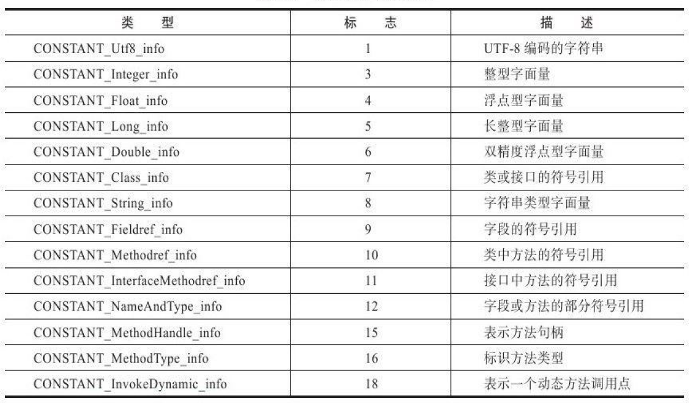

* 访问标志：常量池结束后的两个字节。

* 类索引、父类索引、接口索引集合

* 字段表集合

* 字段表结构

  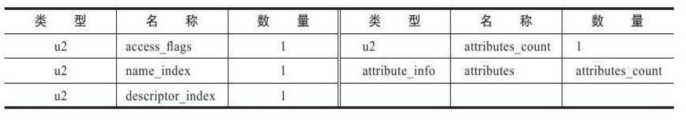

* 方法表集合

* 属性表集合

  虚拟机规范中的常用预定义属性

  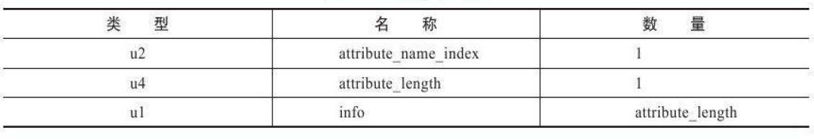

  * Code属性：Java程序方法体中的代码经过Javac编译器处理后，最终变为字节码指令存储在Code属性内。
  * Exceptions属性：列举出方法中可能抛出的受查异常。
  * LineNumberTable属性：于描述Java源码行号与字节码行号（字节码的偏移量）之间的对应关系。
  * LocalVaribleTable属性：描述栈帧中局部变量表中的变量与Java源码中定义的变量之间的关系。
  * SourceFile属性：用于记录生成这个Class文件的源码文件名称。
  * InnerClasses属性：用于记录内部类与宿主类之间的关联。
  * Signature属性：任何类、接口、初始化方法或成员的泛型签名如果包含了类型变量（Type Variables）或参数化类型（Parameterized Types），则Signature属性会为它记录泛型签名信息。反射API能够获取泛型类型，最终的数据来源就是这个属性。

### 字节码指令

JVM指令由一个字节长度的、代表着某种特定操作含义的数字（称为操作码，Opcode）以及跟随其后的零至多个代表此操作所需参数（称为操作数，Operands）而构成。由于JVM采用面向操作数栈的架构，所以大多数的指令都不包含操作数，只有一个操作码。

## 类加载机制

在Java语言里面，类型的加载、连接和初始化过程都是在程序运行期间完成的。

### 类加载的时机

* 类的生命周期

  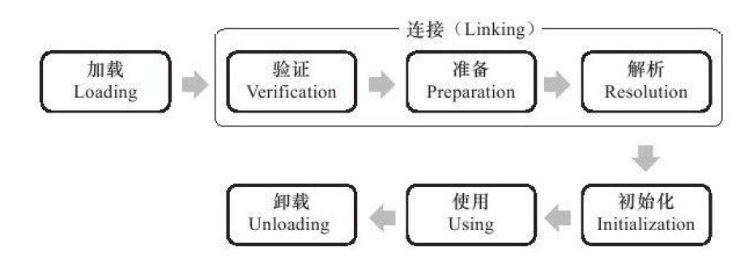

* 有且只有5种情况必须立即对类进行初始化(**接口不满足第三条**)

  1. 遇到new(实例化对象)、getstatic(读取静态字段)、putstatic(设置静态字段)或invokestatic(调用静态方法)这4条字节码指令。
  2. 反射。
  3. 当初始化一个类的时候，如果发现其父类还没有进行过初始化，则需要先触发其父类的初始化。
  4. 虚拟机启动时先初始化主类(包含main方法的类)。
  5. 动态语言支持。

* 被动引用的例子(**被动引用不会引发类的初始化**)

  1. 通过子类引用父类的静态字段，初始化父类时，不会导致子类的初始化。
  2. 通过数组定义引用类，初始化数组时，不会触发此类的初始化。
  3. 引用类的常量不会触发该类的初始化。(**<u>常量在编译阶段存入调用类的常量池中</u>**)

### 类加载的过程

* 加载
  1. 通过类全限定名获取类的字节码。
  2. 将这个字节流所代表的静态存储结构转化为方法区的运行时数据结构。
  3. 在内存中生成一个代表这个类的java.lang.Class对象，作为方法区这个类的各种数据的访问入口。

* 验证

  * 文件格式验证(是否符合Class文件格式规范)
  * 元数据验证(字节码描述的信息进行语义分析)
  * 字节码验证(确定程序语义是合法的、符合逻辑)
  * 符号引用验证(对类自身以外（常量池中的各种符号引用）的信息进行匹配性校验)

* 准备

  准备阶段是正式为类变量分配内存并设置类变量初始值的阶段，这些变量所使用的内存都将在方法区中进行分配。

* 解析

  解析阶段是虚拟机将常量池内的符号引用替换为直接引用的过程。

  解析动作主要针对类或接口、字段、类方法、接口方法、方法类型、方法句柄和调用点限定符7类符号引用进行，分别对应于常量池的CONSTANT_Class_info、CONSTANT_Fieldref_info、CONSTANT_Methodref_info、CONSTANT_InterfaceMethodref_info、CONSTANT_MethodType_info、CONSTANT_MethodHandle_info和CONSTANT_InvokeDynamic_info 7种常量类型。

* 初始化

  初始化阶段是执行类构造器＜clinit＞（）方法的过程。

  ＜clinit＞（）方法是由编译器自动收集类中的所有类变量的赋值动作和静态语句块（static{}块）中的语句合并产生的，**<u>编译器收集的顺序是由语句在源文件中出现的顺序所决定的</u>**。

  静态语句块中只能访问到定义在静态语句块之前的变量，定义在它之后的变量，在前面的静态语句块可以赋值，但是不能访问。

  虚拟机会保证在子类的＜clinit＞（）方法执行之前，父类的＜clinit＞（）方法已经执行完毕。

  如果一个类中没有静态语句块，也没有对变量的赋值操作，那么编译器可以不为这个类生成＜clinit＞（）方法。

  虚拟机会保证一个类的＜clinit＞（）方法在多线程环境中被正确地加锁、同步。

  执行接口的＜clinit＞（）方法不需要先执行父接口的＜clinit＞（）方法。只有当父接口中定义的变量使用时，父接口才会初始化。接口的实现类在初始化时也一样不会执行接口的＜clinit＞（）方法。

### 类加载器

* 双亲委派模型

  启动类加载器（Bootstrap ClassLoader）：加载在＜JAVA_HOME＞\lib目录中类。

  扩展类加载器（Extension ClassLoader）：加载＜JAVA_HOME＞\lib\ext目录中类。

  应用程序类加载器（Application ClassLoader）：加载用户类路径（ClassPath）上所指定的类库。

  双亲委派模型：除了顶层的启动类加载器外，其余的类加载器都应当有自己的父类加载器。使用组合（Composition）关系来复用父加载器的代码。

  双亲委派模型的工作过程：如果一个类加载器收到了类加载的请求，首先把这个请求委派给父类加载器去完成，当父加载器反馈自己无法完成这个加载请求（它的搜索范围中没有找到所需的类）时，子加载器才会尝试自己去加载。

## 字节码执行引擎

### 运行时栈帧

栈帧（Stack Frame）是用于支持虚拟机进行<u>方法调用</u>和<u>方法执行</u>的数据结构。

栈帧存储了方法的<u>局部变量表</u>、<u>操作数栈</u>、<u>动态连接</u>和<u>方法返回地址</u>等信息。

每一个方法从调用开始至执行完成的过程，都对应着一个栈帧在虚拟机栈里面从入栈到出栈的过程。

* 栈帧的概念结构

  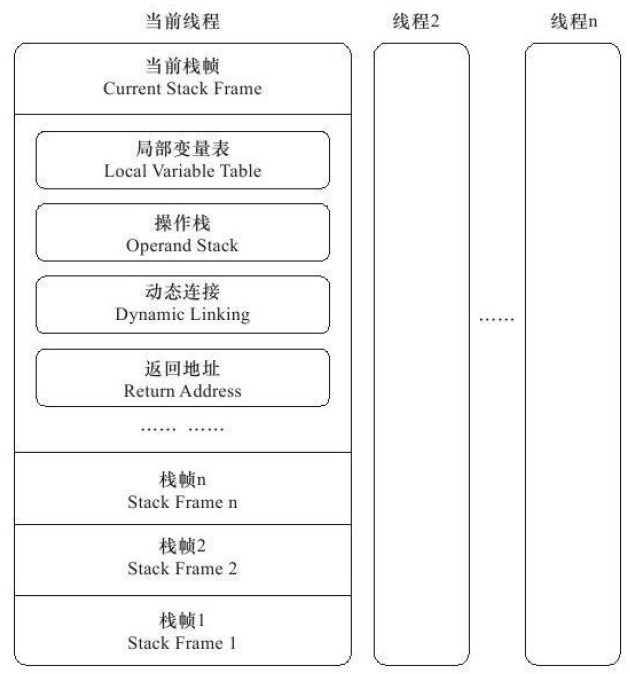

* 局部变量表

  于存放方法参数和方法内部定义的局部变量。

  局部变量表的容量以slot为最小单位。

  boolean、byte、char、short、int、float、reference、returnAddress占用一个slot；long、double占用两个slot。

  **局部变量没有初始化阶段**。即局部便令定义了就必须赋初值。

* 操作数栈

  在方法的执行过程中，会有各种字节码指令往操作数栈中写入和提取内容，也就是出栈/入栈操作。

* 动态链接

  每个栈帧都包含一个指向运行时常量池中该栈帧所属方法的引用，持有这个引用是为了支持方法调用过程中的动态连接（Dynamic Linking）。

* 方法返回地址

  方法退出的过程实际上就等同于把当前栈帧出栈，因此退出时可能执行的操作有：恢复上层方法的局部变量表和操作数栈，把返回值（如果有的话）压入调用者栈帧的操作数栈中，调整PC计数器的值以指向方法调用指令后面的一条指令等。

### 方法调用

<u>**方法调用阶段唯一的任务就是确定被调用方法的版本（即调用哪一个方法）。**</u>

* 解析

  所有方法调用中的目标方法在Class文件里面都是一个常量池中的符号引用，在类加载的解析阶段，会将其中的一部分符号引用转化为直接引用，这种解析能成立的前提是：方法在程序真正运行之前就有一个可确定的调用版本，并且这个方法的调用版本在运行期是不可改变的。这类方法的调用称为解析（Resolution）。

  “编译期可知，运行期不可变”：静态方法和私有方法。

* 分派

  * 静态类型(编译器可知)与实际类型。
  * **重载通过静态类型而不是实际类型作为判定依据。**
  * **所有依赖静态类型来定位方法执行版本的分派动作称为静态分派。**静态分派的典型应用是方法重载。静态分派发生在编译阶段。
  * 动态分派依据实际类型定位方法执行版本。
  * invokevirtual指令的运行时解析过程：
    1. 找到操作数栈顶的第一个元素所指向的对象的实际类型，记作C。
    2. 如果在类型C中找到与常量中的描述符和简单名称都相符的方法，则进行访问权限校验，如果通过则返回这个方法的直接引用，查找过程结束；如果不通过，则返回java.lang.IllegalAccessError异常。
    3. 否则，按照继承关系从下往上依次对C的各个父类进行第2步的搜索和验证过程。
    4. 如果始终没有找到合适的方法，则抛出java.lang.AbstractMethodError异常。
  * 静态多分派、动态单分派。
  * 动态分派使用虚方法表索引来代替元数据查找以提高性能。
  * 虚方法表中存放着各个方法的实际入口地址。如果某个方法在子类中没有被重写，那子类的虚方法表里面的地址入口和父类相同方法的地址入口是一致的，都指向父类的实现入口。如果子类中重写了这个方法，子类方法表中的地址将会替换为指向子类实现版本的入口地址。

### 基于栈的字节码解释执行引擎

Javac编译器完成了程序代码经过词法分析、语法分析到抽象语法树，再遍历语法树生成线性的字节码指令流的过程。因为这一部分动作是在Java虚拟机之外进行的，而解释器在虚拟机的内部，所以Java程序的编译就是<u>半独立</u>的实现。

* 解释执行和编译执行

  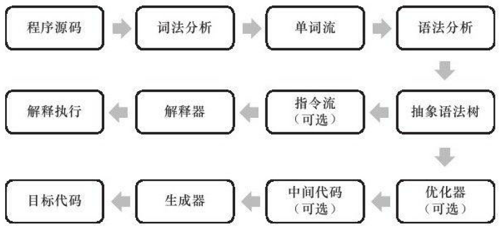

* 基于栈的解释器执行过程(参考《深入理解JVM》中8.4.3的例子)

  ​

  ​

