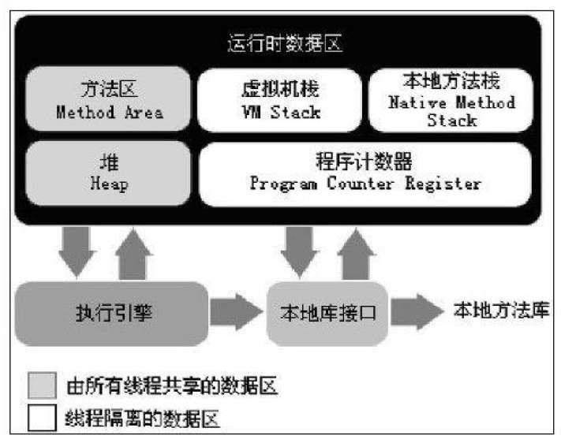
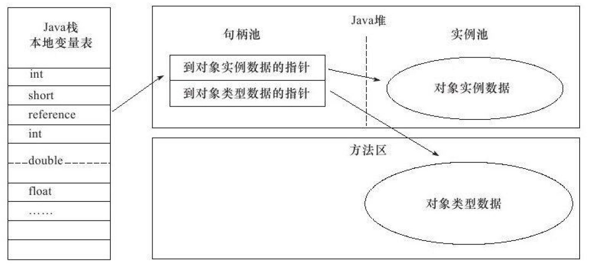
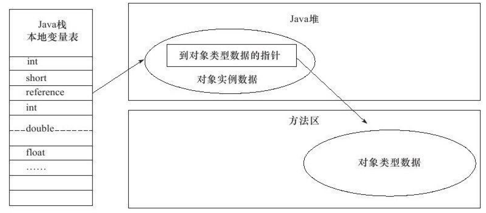

# JVM

## 内存区域与内存溢出异常

### 运行时数据区域

* 程序计数器

  通过改变这个计数器的值来选取下一条需要执行的字节码指令。

  每条线程都需要有一个独立的程序计数器。

* JVM栈

  JVM栈是线程私有的。

  虚拟机栈描述的是Java方法执行的内存模型：每个方法在执行的同时都会创建一个**栈帧**用于<u>存储局部变量表</u>、<u>操作数栈</u>、<u>动态链接</u>、<u>方法出口</u>等信息。每一个方法从调用直至执行完成的过程，就对应着一个栈帧在虚拟机栈中入栈到出
  栈的过程。

  局部变量表存放了编译期可知的各种基本数据类型）、对象引用和returnAddress类型（指向了一条字节码指令的地址）。

  StackOverflowError异常:线程请求的栈深度大于虚拟机所允许的深度.

  OutOfMemoryError异常:虚拟机栈扩展时无法申请到足够的内存.

* 本地方法栈

  本地方法栈则为虚拟机使用到的Native方法服务.

* 堆

  Java堆是被所有线程共享的一块内存区域。

  所有的对象实例以及数组都要在堆上分配[。

* 方法区

  各个线程共享的内存区域。

  用于存储已被虚拟机加载的类信息、常量、静态变量、即时编译器编译后的代码等数据。

* 运行时常量池

  运行时常量池（Runtime Constant Pool）是方法区的一部分。

  Class文件中除了有类的版本、字段、方法、接口等描述信息外，还有一项信息是常量池（Constant Pool Table），用于存放编译期生成的各种字面量和符号引用，这部分内容将在类加载后进入方法区的运行时常量池中存放。

### 虚拟机对象

* 对象的创建

  1. 检查new指令的参数是否能在常量池中定位到一个类的符号引用，并且检查这个符号引用代表的类是否已被加载、解析和初始化过。如果没有，那必须先执行相应的类加载过程。
  2. 在类加载检查通过后，虚拟机将为新生对象分配内存。
  3. 将分配到的内存空间都初始化为零值。
  4. 设置对象头(对象是哪个类的实例、如何才能找到类的元数据信息、对象的哈希码、对象的GC分代年龄等信息)。
  5. 执行＜init＞方法。

* 对象的内存布局

  对象在内存中存储的布局可以分为3块区域：<u>对象头</u>（Header）、<u>实例数据</u>（Instance Data）和对齐填充。

  **对象头**包括两部分信息，第一部分用于存储对象自身的运行时数据，如哈希码（HashCode）、GC分代年龄、锁状态标志、线程持有的锁、偏向线程ID、偏向时间戳等;对象头的另外一部分是类型指针，即对象指向它的类元数据的指针，虚拟机通过这个指针来确定这个对象是哪个类的实例。如果对象是一个Java数组，那在对象头中还必须有一块用于记录数组长度的数据。

  **实例数据**部分是对象真正存储的有效信息，也是在程序代码中所定义的各种类型的字段内容。

* 对象的访问定位

  程序需要通过栈上的reference数据来操作堆上的具体对象。

  **句柄访问**：Java堆中将会划分出一块内存来作为句柄池，reference中存储的就是对象的句柄地址，而句柄中包含了对象实例数据与类型数据各自的具体地址信息。

  

  **指针访问**：reference中存储的直接就是对象地址。

  

## GC

### 可达性分析算法

* 基本思路

  通过一系列的称为“GC Roots”的对象作为起始点，从这些节点开始向下搜索，搜索所走过的路径称为引用链（Reference Chain），当一个对象到GC Roots没有任何引用链相连时，则证明此对象是不可用的。

* 可作为GC Roots的对象

  虚拟机栈（栈帧中的本地变量表）中引用的对象。

  方法区中类静态属性引用的对象。

  方法区中常量引用的对象。

  本地方法栈中JNI（即一般说的Native方法）引用的对象。

### 引用

* 强引用

* 软引用

  在系统将要发生内存溢出异常之前，将会把这些对象列进回收范围之中进行第二次回收。

* 弱引用

  被弱引用关联的对象只能生存到下一次垃圾收集发生之前。

* 虚引用

  为一个对象设置虚引用关联的唯一目的就是能在这个对象被收集器回收时收到一个系统通知。

  一个对象是否有虚引用的存在，完全不会对其生存时间构成影响，也无法通过虚引用来取得一个对象实例。

