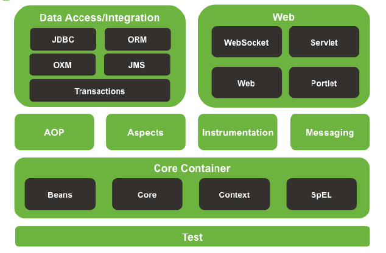
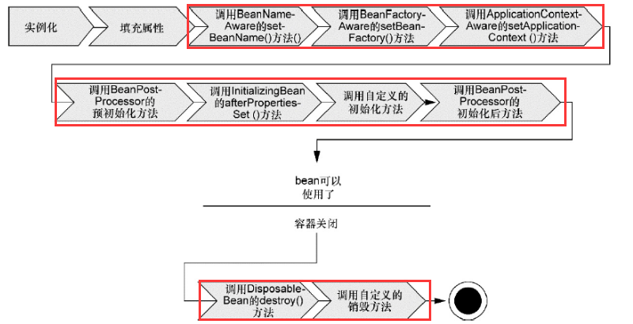
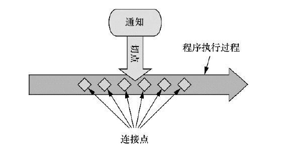
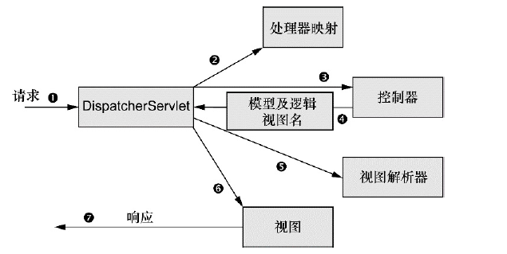

# *Spring in Action 读书笔记*   #


## Spring整体结构


## Springd的四种关键策略

- 基于POJO的轻量级和最小侵入性编程；

- 通过依赖注入和面向接口实现松耦合；

  ​	***通过DI，对象的依赖关系将由系统中负责协调各对象的第三方组件在创建对象的时候进行设定。对象无需自行创建或管理它们的依赖关系。***

- 基于切面和惯例进行声明式编程；

- 通过切面和模板减少样板式代码。

## Spring创建Bean

- XML中显示配置。

- 通过*javaConfig* 类配置。

- 隐式的bean发现机制和自动装配。


## Spring容器

### Spring应用上下文

- *AnnotationConfigApplicationContext*：从一个或多个基于Java的配置类中加载Spring应用上下文。
- *AnnotationConfigWebApplicationContext*：从一个或多个基于Java的配置类中加载Spring Web应用上下文。
- *ClassPathXmlApplicationContext*：从类路径下的一个或多个XML配置文件中加载上下文定义，把应用上下文的定义文件作为类资源。
- *FileSystemXmlapplicationcontext*：从文件系统下的一个或多个XML配置文件中加载上下文定义。
- *XmlWebApplicationContext*：从Web应用下的一个或多个XML配置文件中加载上下文定义。

### Spring容器中的Bean的生命周期



## 自动化装配bean

Spring从两个角度来实现自动化装配:

* 组件扫描（component scanning）：Spring会自动发现应用上下文中所创建的bean。

* 自动装配（autowiring）：Spring自动满足bean之间的依赖。

  ​

  ### 创建可被发现的bean


* `@Component`:注解在类声明前，表明该类会作为组件类，并告知Spring要为这个类创建bean。

* `@ComponentScan`:注解在类声明前，启用组件扫描。Spring将会扫描这个包以及这个包下的所有子包，查找带有`@Component`注解的类。

* 通过XML启用组件扫描：

  ```xml
  <context:componet-scan base-package="xxx"/
  ```

* `@RunWith(SpringJUnit4ClassRunner.class)`:在测试类声明前使用该注解表示使用Spring的单元测试

* `@ContextConfiguration(CLASSES = XXX.class)`:在测试类声明前使用该注解，表示需要从`XXX`类中加载配置。

* `@Component("bean1")`:在类声明前使用该注解，为bean设置id为bean1.

  ​

  ### 设置组件扫描的基础包

* `@Configuration`:在类声明前使用该注解，表明这个类是一个配置类，该类包含了在Spring应用上下文中如何创建bean的细节。创建JavaConfig类的关键在于为其添加`@Configuration`注解.

* `@ComponentScan("package1")`:指明扫描的包的名称。

* `@ComponentScan(basepackage = {"package1","package2"})`:指明多个扫描的基础包的名称。

* `@ComponentScan(basepackageClasses = {A.class，B.class})`:类所在的包将作为组件扫描的基础包。

  ​

  ### 自动装配

* `@Autowired`:该注解可使用在类声明前，带惨构造器前，setter方法前，基于类的类型实现自动装配。如果有多个匹配的bean或没有可匹配的bean时，都将报异常。

* `@Autowired(required = false)`:如果没有可匹配的bean，这个bean将处于未装配状态。

* `@Inject`:该注解来源于java依赖注入规范，大多数场景下可以和`@Autowired`互换。

## 通过java代码装配bean

* 通过java代码装配bean首先需要创建JavaConfig类，创建该类的关键是为其添加`@Configuration`注解。

* `@Bean`:在JavaConfig类中声明bean，需要编写一个会创建所需类型的实例的方法，然后给这个方法添加`@Bean`注解。方法体中包含了最终产生bean实例的逻辑。默认情况下bean的ID与获得bean实例的方法名一致。

  ```java
  @Bean
  public A aInstance(){
    return new A();
  }
  ```

* `@Bean(name = "bean1")`:指明bean的id。

  ### 借助JavaConfig实现注入

  ```java
  package beans;
  import org.springframwork.context.annotation.Configuration;
  @Configuration
  public class JavaConfig{
    @Bean
    public A aInstance(){
      return new A();
    }
    @Bean
    public B bInstance(){
      return new B(aInstance());
    }
  }
  ```

  因为`aInstance()`方法上添加了`@Bean`注解，Spring默认创建的对象的模式时单例的，Spring将会拦截所有对它的调用，并确保直接返回该方法所创建的bean，而不是每次都对其进行实际的调用。

  * 通过传入参数实现*DI*

  ```java
    @Bean
    public B bInstance(A a){
      return new B(a);
    }
  ```

  ​

  * 通过setter实现*DI*

  ```java
    @Bean
    public B bInstance(A a){
      b = new B();
      b.setA(a);
      return b;
    }
  ```

## 通过XML装配bean

### 借助构造器注入初始化bean

```xml
<bean id = "aId" class = "xxx.xxx.A">
	<constructor-arg ref = "bId"/>                       <!--注入bean-->
    <constructor-arg value = "aStringArg"/>              <!--注入String-->
    <constructor-arg><null/></constructor-arg>           <!--注入null-->
  	<constructor-arg>                                    <!--注入集合-->
      <list>
      	<value>"a"</value>
        <value>"b"</value>
        <value>"c"</value>
      </list>
    </constructor-arg>
  	<constructor-arg>                                    <!--注入集合-->
      <list>
		<ref bean = "beanId1"/>
        <ref bean = "beanId2"/>
        <ref bean = "beanId3"/>
      </list>
  	</constructor-arg>
</bean>
  
<bean id = "bId" class = "xxx.xxx.B">
</bean>  
```

### 基于setter初始化bean

```xml
<bean id = "aId" class = "xxx.xxx.A">
	<property name = "b" ref = "bId"></property>
  	<property name = "strArg" value = "aStringArg"></property>
  	<property name = "list">
  		<value>a</value>
      	<value>b</value>
      	<value>c</value>
  	</property>
</bean>
```


## 导入和混合配置

* `@Import({X.class，Y.class})`  ：在一个JavaConfig类中导入另一个JavaConfig类中的Beans。

* `@ImportResource("classpath:x.xml")`：导入定义在*x.xml* 中的Bean。
* 可以通过`<import>`元素引入其他*xml* 文件。

## profile(用于条件化创建bean)

通过使用profile可以条件化创建Bean。

* `@Profile("profileA")`:在JavaConfig类前声明`@Profile`，可以使用`@Profile`注解指定某个该JavaConfig类中声明的Bean属于哪一个profile.它会告诉Spring这个配置类中的bean只有在*profileA profile* 激活时才会被创建。
* `@Profile("profile_A")`:在方法前声明`@Profile`配合`@Bean`声明一起使用。
* 可以通过`<beans>`的*profile* 属性在XML中配置*profile bean* 。

### 激活profile

Spring通过*spring.profiles.active* 和*spring.profiles.default* 判断哪个*profile* 处于激活状态。

*spring.profiles.active* 的优先级高于*spring.profiles.default* 。

激活方式：

- 作为DispatcherServlet的初始化参数；

  在web.xml中作如下配置

  ```xml
  	<!--为DispatcherServlet设置默认的profile-->
  	<servlet>
  		<servlet-name>dispatcher</servlet-name>
  		<servlet-class>org.springframework.web.servlet.DispatcherServlet</servlet-class>
  		<init-param>
  			<param-name>spring.profiles.default</param-name>
  			<param-value>profileA</param-value>
  		</init-param>
  		<load-on-startup>1</load-on-startup>
  	</servlet>
  	<servlet-mapping>
  		<servlet-name>dispatcher</servlet-name>
  		<url-pattern>/</url-pattern>
  	</servlet-mapping>
  ```

  ​

- 作为Web应用的上下文参数；

  ```xml
  <!--为上下文设置默认的profile-->
  <listener>
  	<listener-class>
    		org.springframework.web.context.ContextLoaderListener
    	</listener-class>
  </listener>
  <context-param>
  	<param-name>spring.profiles.default</param-name>
    	<param-value>profileA</param-value>
  </context-param>
  ```

  ​

- 作为JNDI条目；

- 作为环境变量；

- 作为JVM的系统属性；

- 在集成测试类上，使用@ActiveProfiles注解设置。

  ```java
  @RunWith(SpringJUnit4ClassRunner.class)
  @ContextConfiguration(class={SpringTest.class})
  @ActiveProfiles("profileA")
  public class SpringTest{...}
  ```

  ​

## 条件化的Bean

```java
@Bean
@Conditional(SomeCondition.class)
public A aInstance(){
  return new A();
}
```

`SomeCondition`需要实现Condition接口,指明条件：

```java
public interface Condition{
  boolean matches(ConditionContext ctxt,AnnotatedTypeMetadata metadata);
}
```

通过`ConditionContext`可以做到：

- 借助getRegistry()返回的BeanDefinitionRegistry检查bean定义；
- 借助getBeanFactory()返回的ConfigurableListableBeanFactory检查bean是否存在，甚至探查bean的属性；
- 借助getEnvironment()返回的Environment检查环境变量是否存在以及它的值是什么；
- 读取并探查getResourceLoader()返回的ResourceLoader所加载的资源；
- 借助getClassLoader()返回的ClassLoader加载并检查类是否存在。

借助`AnnotatedTypeMetadata`接口的`isAnnotated()`方法，我们能够判断带有`@Bean`注解的方法是不是还有其他特定的注解。借助`getAnnotationAttributes`方法，我们能够检查`@Bean`注解的方法上其他注解的属性。

## 处理自动装配的歧义性

### 标示首选的bean

```java
@Component
@Primary
public class A{}
```

```java
@Bean
@Primary
public A aInstance{return new A();}
```

```xml
<bean id = "A" class = "xxx.xxx.A" primary = true/>
```

### 限定自动装配的bean

```java
@Autowired
@Qualifier("Aimpl")//使用的参数为注入的bean的ID
public void setA(A a){this.a = a;}
```

`@Qualifier`注解配合`@Component`注解或`@Bean`注解使用可以设置Bean的限定符。

## Bean的作用域

- 单例（Singleton）：在整个应用中，只创建*bean* 的一个实例。
- 原型（Prototype）：每次注入或者通过Spring应用上下文获取的时候，都会创建一个新的*bean* 实例。
- 会话（Session）：在Web应用中，为每个会话创建一个*bean* 实例。
- 请求（Rquest）：在Web应用中，为每个请求创建一个*bean* 实例。

### 设置bean的作用域

- 使用`@Scope`结合`@Component`或者`@Bean`配置*Bean* 的作用域。

- 使用`<bean>`元素的*scope*属性配置*Bean* 的作用域。


### 使用会话和请求作用域

```java
@Component
@Scope(value = WebApplicationContext.SCOPE_SESSION,proxyMode = ScopedProxyMode.INTERFACES)
public A aInstance(){...}
```

- 通过设置注解`@Scope(value = WebApplicationContext.SCOPE_SESSION,proxyMode = ScopedProxyMode.INTERFACES)`表明要生成目标接口`A`的代理。

- 通过设置注解`@Scope(value = WebApplicationContext.SCOPE_SESSION,proxyMode = ScopedProxyMode.TARGET_CLASS)`表明要生成目标类`A`的代理。其中对目标类的代理必须依赖*CGLIB*实现。


通过上述两种方式解决将原型*bean*注入单例*bean*的问题。

基于XML实现代理:

```xml
<bean id = "a" class = "A" scope = "session">
	<aop:scoped-proxy/>
</bean>
```

```xml
<bean id = "b" class = "B" scope = "session">
	<aop:scoped-proxy proxy-target-class = false/>
</bean>
```

`<aop:scoped-proxy>`会告诉Spring为bean创建一个作用域代理。默认使用CGLib。

## 运行时注入

### 注入外部的值

通过在JavaConfig类前声明`@PropertySource("classpath:/xxx/xxx/aap.properties")`可以将属性文件中的属性加载到Spring的Environment中。

```java
@Configuration
@PropertySource("classpath:/xxx/xxx/app.properties")
public class Config{
  
  @Autowired
  Environment env;
  
  @Bean
  public SomeBean beanInstance(){
    return new SomweBean(env.getProperty("propertyA"),env.getProperty("propertyB"));
  }
}
```


### 解析属性占位符

- 占位符形式：*${...}*

- 占位符使用配置：`<context:propertyplaceholder>`

- `@Value`可以结合占位符使用为属性赋值，如`@Value(“${...}”)`


```java
public A(@Value("$(prop.propertyA)") String propertyA,@Value("$(prop.propertyB)") String propertyB){
 	this.propertyA = propertyA;
  	this.propertyB = propertyB;
}
```


## AOP



**切点的粒度比连接点更细。**

Spring切面可以应用5种类型的通知：

- 前置通知（Before）：在目标方法被调用之前调用通知功能；
- 后置通知（After）：在目标方法完成之后调用通知，此时不会关心方法的输出是什么；
- 返回通知（After-returning）：在目标方法成功执行之后调用通知；
- 异常通知（After-throwing）：在目标方法抛出异常后调用通知；
- 环绕通知（Around）：通知包裹了被通知的方法，在被通知的方法调用之前和调用之后执行自定义的行为。

### 编写切点

* 切点表达式

  ```java
  		execution([modifiers-pattern]          // 访问权限类型
  				   ret-type-pattern		       //返回值类型
  				  [declaring-type-pattern]     //全限定类名
  				   name-pattern(param-pattern) //方法名(参数名)
  				  [throws-pattern]             //抛出异常类型
  					)
            //[]表示非必需
  ```

* 使用`within(xxx.xxx.service.*)`表达式配合逻辑表达式`&&`或`and`限定切点仅匹配特定的包（`xxx.xxx.service.*`）.

* 使用`bean('someBeanId')`表达式配合逻辑表达式`&&`或`and`限定切点仅匹配特定的bean。

* 逻辑表达式有`&&(and),||(or),!(not)`.

### 通过注解创建切面

通过在JavaConfig类中使用注解`@EnableAspectJAutoProxy`启用AspectJ自动代理

```java
@Aspect     //表示当前POJO类为切面
public class Aspect{
  
  		//定义切入点
		@PointCut("execution(* *..ISomeService.doSome(..))")
		private void doSomePointcut(){
		
		}
  
		//定义前置通知方法
		@Before("doSomePointcut")
		public void myBefore(){
		
		}
		
		//定义后置通知
		@AfterReturning("doSomePointcut")
		public vod myAfterReturning(){
		
	    }
		@AfterReturning(value = "doSomePointcut",returning = "result")//声明返回值
		public vod myAfter(Object result){
		
	    }
		
		//定义环绕通知
		@Around("execution(* *..ISomeService.doAnother(..))")
		publc Object myAround(ProceedingJoinPoint pjp) throws Throwable{
			//在方法执行前的处理...
			Object result = pjp.proceed(); //在此处执行方法
			//在方法执行后的处理...
			return result;
		}
		
		//定义异常通知方法
		@AfterThrowing(value = "execution(* *..ISomeService.doSome(..))",throwing="ex")
		public void myAfterThrowing(Exception ex){
		
		}
		
		//定义最终通知方法
		@After("doSomePointcut()")
		pulic void myAfter(){
		
		}
  
       //处理通知中的参数
       @Pointcut("execution(* *..ISomeService.doSomeWithArg(int) && args(someArg)")
  	   public void doSomePointCutWithArg(int someArg){}
       
  	   @Before("doSomePointCutWithArg(someArg)")
	   public void myBefore(int someArg){
         
	   }
  
  	   //通过注解为某个bean注入新功能
  	   @DeclareParents(value = "*..ISomeService+",
                      defaultImpl = AnotherServiceImpl.class)
  	   public static IAnotherService anoterhSevice;
       //value属性指定了哪种类型的bean要引入该接口。"+"表示其子类，而不是其本身。
       //defaultImpl属性指定了为引入功能提供实现的类。
       //@DeclareParents注解所标注的静态属性指明了要引入了接口。
	}                               
```
### 通过XML创建切面

通过在*xml*配置`<aop:aspectj-autoproxy>`使能AspectJ自动代理

```xml
<aop:config>
  <aop:pointcut expression = "execution(* *..service.*.doSome(..))" id="doSomePointcut"/>
  <aop:pointcut expression = "execution(* *..service.*.doScond(..))" id="doSecondPointcut"/>
  <aop:pointcut expression = "execution(* *..service.*.doThird(..))" id="doThirdPointcut"/>
  <aop:pointcut expression = "execution(* *..ISomeService.doSomeWithArg(int) && args(someArg)"                     id="doSomePointCutWithArg"/>
  <aop:aspect ref="myAspect">
    <aop:before method="myBefore" pointcut-ref="doSomePointcut"/>
    <aop:before method="myBefore(org.aspectj.lang.JoinPoint)" pointcut-ref="doSomePointcut"/>
    <aop:after-returning method="myAfterReturning" pointcut-ref="doSomePointcut"/>
    <aop:after-returning method="myAfterReturning(java.lang.Object)" 
                         pointcut-ref="doSomePointcut" returning="result"/>
    <aop:around method="myAround" pointcut-ref="doSecondPointcut"/>
    <aop:after-throwing method="myAfterThrowing" pointcut-ref="doSomePointcut"/>
    <aop:after method="myAfter" pointcut-ref="doSomePointcut"/>
    <aop:before method="myBefore" pointcut="doSomePointCutWithArg"/>
    <aop:declare-parents types-matching = "*..ISomeService+" 
                         implement-interface = "xxx.xxx.service.impl.AnotherServiceImpl" 
                         default-impl = "xxx.xxx.service.IAnotherService"/>
  </aop:aspect>
</aop:config>
```

## Spring MVC

### 整体结构



* *DispatcherServlet*:前端控制器。通过查询一个或多个处理器映射(*handler mapping* )将请求发送至对应的控制器。
* 控制器(*Controller*):获取请求信息，委托服务对象进行业务逻辑处理，返回*model*和视图名给*DispatcherServlet*。
* *DispatcherServlet*使用视图解析器(*view resolver*) 将逻辑视图名匹配为特定的视图实现。
* *DispatcherServlet*实现视图，且交付模型数据。
* 视图渲染输出，响应客户端。

***DispatcherServle*t是Spring MVC的核心。**

## 搭建SpringMVC

基于*java*代码配置DispatcherServlet

```java
import org.springframework.web.servlet.support.AbstractAnnotationConfigDispatcherServletInitializer;
public class MyWebAppInitializer extends AbstractAnnotationConfigDispatcherServletInitializer{
  @Override
  protected String[] getServletMappings(){
    return new String[]{"/"};
  }
  @Override
  protected Class<?>[] getRootConfigClasses(){
    return new Class<?>[]{RootConfig.class};
  }
  protected Class<?>[] getServletConfigClasses(){
    return new Class<?>[]{WebConfig.class};
  }
```

```java
@Configuration
@EnableWebMvc
@ComponentScan("xxx.beans")
public class WebConfig extends WebMvcConfigurerAdapter{
  @Bean
  public ViewResolver viewResolver(){
    InternalResouceViewResolver resolver = new InternalResouceViewResolver();
    resolver.setPrefix("/WEB-INF/views/");
    resolver.setSuffix(".jsp");
    resolver.setExposeContextBeansAsAttributes(true); //?
    return resolver;
  }
}
```

```java
@Configuration
@ComponentScan(basePackages={"xxx.beans"},excludeFilters={@Filter(type=FilterType.ANNOTATION,value=EnableWebMvc.class)})
public class RootConfig{}
```

#### MyWebAppInitializer类

1. 在Servlet3.0中，Servlet容器会在类路径中查找实现`javax.servlet.ServletContainerInitializer`接口的类以配置Servlet容器。
2. `SpringServletContainerInitializer`提供`ServletContainerInitializer`接口的实现，它会查找实现`WebApplicationInitializer`的类并将配置任务交与这些类。
3. `AbstractAnnotationConfigDispatcherServletInitializer`是`WebApplicationInitializer`的基础实现。
4. `getServletMappings()`将一个或多个路径映射到`DispatcherServlet`上。
5. `getServletConfigClasses()`返回的类用来定义带有`@Configuration`注解的类将会用来定义`DispatcherServlet`创建的应用上下文中的bean。
6. `getRootConfigClasses()`方法返回的带有`@Configuration`注解的类将会用来配置ContextLoaderListener创建的应用上下文中的bean。

- **DispatcherServlet加载包含Web组件的bean，如控制器、视图解析器以及处理器映射；**
- **ContextLoaderListener要加载应用中的其他bean。这些bean通常是驱动应用后端的中间层和数据层组件。**

#### WebConfig类

1. `@EnableWebMvc`表示启用SpringMVC。
2. `viewResolver()`返回视图解析器。
3. `configureDefaultServletHandling()`方法通过调用`DefaultServletHandlerConfigurer`的`enable()`方法要求DispatcherServlet将对静态资源的请求转发到Servlet容器中默认的Servlet上，而不是使用DispatcherServlet本身来处理此类请求。

#### RootConfig类

`excludeFilters={@Filter(type=FilterType.ANNOTATION,value=EnableWebMvc.class)`表示`@ComponentScan`不包含`@EnableWebMvc`注解。

## 基本控制器

```java
@Controller
@RequestMapping("/user")
public class UserController {
	
	@Autowired
	private UserService userService;

	@RequestMapping(value = "/login",method = RequestMethod.POST) 
  	//执行该方法对应的请求路为/webapp/user/login
  	//请求方式为POST
    //返回的界面名称为success.jsp或者error.jsp
	public String login(User user,Model model){    
		User loginUser = userService.getUser4Login(user);
		if(loginUser != null){
			model.addAttribute("user", loginUser);//模型数据会作为请求的属性放到请求当中
			return "success";
		}
		else{
			return "error";
		}
	}
}
```

## 接收请求的输入

### 处理查询参数

```java
@RequestMapping(method = RequstMethod.GET)
public String login(
	@RequestParam(value = "id",defaultValue = "0") long id,      
  	@RequestParam(value = "code",defaultValue = "0") long code   
  	//Spring会进行自动类型转换,将String类型转换为方法参数中对应的数据类型
){
	//......
  	return "someViewName";
}
```

### 通过路径参数处理输入

通过在`@RequestMapping`路径中添加占位符实现。

```java
@RequestMapping(value = "/{id}")
public String login(@PathVariable("id") long id)
//将路径信息作为方法参数传递进来
{
  //...
  return "someViewName";  
}
```

### 处理表单

```java
public class User {
  	@NotNull
	private Integer id;
  	@NotNull
  	@Size(min = 5,max = 16)     //表单信息限制条件
	private String username;
	private String password;
	public Integer getId() {
		return id;
	}
	public void setId(Integer id) {
		this.id = id;
	}
	public String getUsername() {
		return username;
	}
	public void setUsername(String username) {
		this.username = username;
	}
	public String getPassword() {
		return password;
	}
	public void setPassword(String password) {
		this.password = password;
	}
}
```

```java
@Controller
@RequestMapping("/user")
public class UserController {
	
	@Autowired
	private UserService userService;

	@RequestMapping("/login")
	public String login(@Valid User user,Model model)
      //user中的属性将会使用请求中的同名参数填充
      //@Valid表示User需满足校验
    {     
		User loginUser = userService.getUser4Login(user);
		return "redirect:/user" + loginUser.getId();
      	//InternalResourceViewResolver会将“redirect:”前缀解析为重定向规则
      	//InternalResourceViewResolver会将“forward:”前缀解析为转发规则
	}
}
```

## Spring MVC配置的可替代方案

### 自定义*DispatchServlet*配置

在*AbstractAnnotationConfigDispatcherServletInitializer*将*DispatcherServlet*注册到Servlet容器中之后，将调用`customizeRegistration(Registration.Dynamic registeration)`，通过重写`customizeRegistration()`方法，我们可以对DispatcherServlet进行额外的配置。

借助`customizeRegistration()`方法中的`ServletRegistration.Dynamic`，能完成：

- 通过调用`setLoadOnStartup()`设置load-on-startup优先级；
- 通过`setInitParameter()`设置初始化参数；
- 通过调用setMultipartConfig()配置Servlet3.0对multipart的支持。

通过重载*AbstractAnnotationConfigDispatcherServletInitializer*的`Filter[] getServletFilters()`方法，可注册Filter并将其映射到*DispatcherServlet*。

### 添加其他的Servlet和Filter

通过实现Spring的*WebApplicationInitializer*接口注册其他Servlet、Filter、Listener。

注册Servlet：

```java
public class MyServletInitializer implements WebApplicationInitializer{
  @Override
  public void onStartup(ServletContext servletContext) throws ServletException{
    javax.servlet.ServletRegisteration.Dynamic myServlet = servletContext.addServlet("myServlet",MyServlet.class);
    myServlet.addMapping("/myServlet/**");
  }
}
```

注册Filter：

```java
public class MyFilterInitializer implements WebApplicationInitializer{
  @Override
  public void onStartup(ServletContext servletContext) throws ServletException{
    javax.servlet.FilterRegisteration.Dynamic myFilter = servletContext.addServlet("myServlet",MyServlet.class);
    myServlet.addMappingForUrlPatterns(null,false,"/myServlet/*");
  }
}
```

### 基于web.xml配置DispatcherServlet

基于纯xml：

```xml
<!--配置ContexLoadListener-->
<context-param>
  <param-name>contextConfigLocation</param-name>
  <param-value>classpath:spring-mybatis.xml</param-value>
</context-param>
<listener>
  <listener-class>org.springframework.web.context.ContextLoaderListener</listener-class>
</listener>

<!--配置DispatcherServlet-->
<servlet>
  <servlet-name>dispatcher</servlet-name>
  <servlet-class>org.springframework.web.servlet.DispatcherServlet</servlet-class>
  <init-param>
    <param-name>contextConfigLocation</param-name>
    <param-value>classpath:spring-mvc.xml</param-value>
  </init-param>
  <load-on-startup>1</load-on-startup>
</servlet>
<servlet-mapping>
  <servlet-name>dispatcher</servlet-name>
  <url-pattern>*.do</url-pattern>
</servlet-mapping>

```

基于java配置的web.xml

```xml
<context-param>
  <param-name>contextClass</param-name>
  <param-value>
  	org.springframework.web.context.support.AnnotationConfigWebApplicationContext
  </param-value>
</context-param>

<context-param>
  <param-name>contextConfigLocation</param-name>
  <param-value>
  	com.lo.ssm.config.RootConfig
  </param-value>
</context-param>

<listener>
  <listener-class>org.springframework.web.context.ContextLoaderListener</listener-class>
</listener>

<!--配置DispatcherServlet-->
<servlet>
  <servlet-name>dispatcher</servlet-name>
  <servlet-class>org.springframework.web.servlet.DispatcherServlet</servlet-class>
  <init-param>
    <param-name>contextClass</param-name>
    <param-value>
      org.springframework.web.context.support.AnnotationConfigWebApplicationContext
    </param-value>
  </init-param>
  <init-param>
    <param-name>contextClass</param-name>
    <param-value>
      com.lo.ssm.config.webConfig
    </param-value>
  </init-param>
  <load-on-startup>1</load-on-startup>
</servlet>
<servlet-mapping>
  <servlet-name>dispatcher</servlet-name>
  <url-pattern>*.do</url-pattern>
</servlet-mapping>
```

## 处理multipart形式的数据

### multipart解析器

*DispatcherServlet*委托Spring中的*MultipartResolver*策略接口实现解析multipart请求数据的功能。

Spring内置两个*MultipartResolver*接口的实现：

* *CommonMultipartResolver*
* *StandarServletMultipartResolver*

### 基于StandarServletMultipartResolver

* 创建解析器bean

  ```java
  @Bean
  public MulipartResolver multipartResolver() throws IOException{
    return new StandardServletMultipartResolver();
  }
  ```

* 配置解析器

  在web.xml或Servlet初始化类中，将multipart的具体细节作为DispatcherServlet配置的一部分。

  1. 采用Servlet初始化类的方式配置DispatcherServlet

     ```java
       @Override
       public void onStartup(ServletContext servletContext) throws ServletException{
         DispatcherServlet ds = new DispatcherServlet();
         javax.servlet.ServletRegisteration.Dynamic registration = servletContext.addServlet("dispatcherServlet",ds);
         registration.addMapping("/");
         registration.setMultipartConfig(new MultipartConfigElement("/uploads",2097152,4194304,0));
         //设定上传文件的临时存放路径，最大容量(字节)，整个multipart请求的最大容量，写入临时文件路径的文件大小值
       }
     ```

  2. 采用AnnotationConfigDispatcherServletInitializer或AbstractDispatcherServletInitializer

     ```java
     @Override
     protected void customizeRegistration(Dynamic registration){
       registration.setMultipartConfig(new MyltipartConfigElement("/upload"));
     }
     ```

  3. 基于web.xml

     ```xml
     <servlet>
       <servlet-name>dispatcher</servlet-name>
       <servlet-class>org.springframework.web.servlet.DispatcherServlet</servlet-class>
       <load-on-startup>1</load-on-startup>
       <multipart-config>
       	<location>/upload</location>
         <max-file-size>2097152</max-file-size>
         <max-request-size>4194304</max-request-size>
       </multipart-config>
     </servlet>
     ```

### 基于CommonMultipartResolver

* 创建解析器bean并配置解析器

  ```java
  @Bean
  public MultipartResolver multipartResolver(){
    CommonMultipartResolver multipartResoler =  new CommonMultipartResolver();
    //设置临时文件路径，若不设置，默认为Servlet容器的临时目录
    multipartResolver.setUploadTempDir(new FileSystemResource("/upload"));
    //设置其他属性
    multipartResolver.setMaxUploadSize(2097152);
    multipartResolver.setMaxInMemorySize(0);
    return multipartResoler;
  }
  ```

### 处理multipart请求

使用MultipartFile接口处理上传的文件

```java
public interface MultipartFile{
  String getName();
  String getOriginalFileName();
  String getContentType();
  boolean isEmty();
  long getSize();
  byte[] getBytes() throws IOException;
  InputStream getInputStream() throws IOException;
  void transferTo(File dest) throws IOException;
}
```

创建上传控制器

```java
@Controller  
public class FileUpoadController {  
  
    @RequestMapping(value = "/form", method = RequestMethod.POST)  
    public String handleFormUpload(@RequestParam("name") String name,  
        @RequestParam("file") MultipartFile file) {  
  
        if (!file.isEmpty()) {  
            byte[] bytes = file.getBytes();  
            // store the bytes somewhere  
           return "redirect:uploadSuccess";  
       } else {  
           return "redirect:uploadFailure";  
       }  
    }  
} 
```

## 处理异常

### 将异常映射为HTTP状态码

```java
@ResponseStatus(value=HttpStatus.NOT_FOUND,reason="xxx not found")
public class XxxNotFoundException extends RuntimeException{}
```

### 处理异常

```java
@ExceptionHandler(XxxNotFoundException.class)
public String handleXxxNotFound(){
  return "error/notFound";
}
```

`@ExceptionHandler`注解标注的方法能处理同一个控制器中所有处理器方法所抛出的异常。

## 为控制器添加通知

控制器通知（controller advice）是任意带有`@ControllerAdvice`注解的类，这个类会包含一个或多个如下类型的方法：

- `@ExceptionHandler`注解标注的方法；
- `@InitBinder`注解标注的方法；
- `@ModelAttribute`注解标注的方法。

在带有`@ControllerAdvice`注解的类中，以上所述的这些方法会运用到整个应用程序所有控制器中带有`@RequestMapping`注解的方法上。

## 重定向

使用路径变量和查询参数传递数据。


