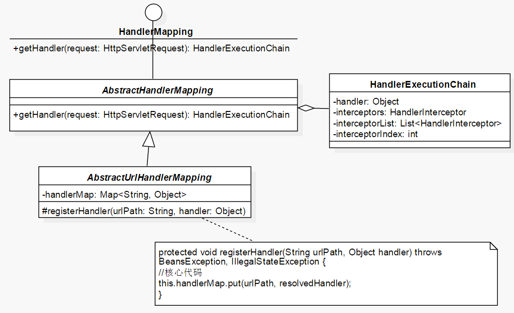

# Spring源码阅读笔记

## Spring IOC 


### IoC初始化过程

1. *Resouce*定位过程。
2. *BeanDefinition*载入过程。
3. 向*IoC*容器注册*BeanDefinition*的过程。

## Spring AOP

### Spring AOP 基本元素


### Spring AOP实现


## SpringMVC 相关

### ContextLoader


### DispatcherServlet


### HandlerMapping



### DispatcherServlet 创建WebApplicationContext的流程

1. `FrameworkServlet`调用`createWebApplicationContext`创建一个`WebApplicationContext`

   ```java
   wac = createWebApplicationContext(rootContext);
   ```

2. 调用`configureAndRefreshWebApplicationContext(WebApplicationContext)`方法初始化和更新Context

   ```java
   configureAndRefreshWebApplicationContext(wac);
   ```

3. 调用`AbstractApplicationContext.refresh()`

   启动AbstractApplicationContext的refresh过程

   1. 获取更新好的bean工厂

      ```java
      ConfigurableListableBeanFactory beanFactory = obtainFreshBeanFactory();
      ```

      在`obtainFreshBeanFactory()`中启动AbstractRefreshableApplicationContext的refreshBeanfacotry过程

      1. 创建一个DefaultListableBeanFactory

         ```java
         DefaultListableBeanFactory beanFactory = createBeanFactory();
         ```

      2. 加载BeanDefinitions

         ```java
         loadBeanDefinitions(beanFactory);
         ```

         启动XmlWebApplicationContext的`loadBeanDefinition(beanFactory)`过程

         1. 创建一个XmlBeanDefinitionReader，并将该beanFactory作为其registry
         2. 调用reader的`loadBeanDefinition(ConfigLocation)`方法
         3. 最终将所有的BeanDefinition放入BeanDefinitionReader的registry中的`Map<String,Beandefinition>`中，如果是xml中读到的bean，使用GenericBeanDefinition，如果是通过注解扫描到的bean，使用ScannedGernericBeanDefinition。

      3. 将AbstractRefreshableApplicationContext的beanFactory设置为之前创建的beanFactory。

   2. 调用`registerBeanPostProcessors(beanFactory)`注册所有的bean后处理器。

   3. 调用beanFactory.preInstantiateSingletons()实例化所有尚未实例化的bean。

      基于AutoWired注解的检测在AutowiredAnnotationBeanPostProcessor中的

      ```java
      public void postProcessMergedBeanDefinition(RootBeanDefinition beanDefinition, Class<?> beanType, String beanName)
      ```

      基于AutoWired注解的注入在AutowiredAnnotationBeanPostProcessor中的

      ```java
      public PropertyValues postProcessPropertyValues(PropertyValues pvs, PropertyDescriptor[] pds, Object bean, String beanName) throws BeansException
      ```

## tinySpringMVC

一个基于SpringMVC思路设计的轻量级MVC框架，实现了Iop和SpringMVC的基本功能。

[工程源码][https://github.com/lologame/tinySpringMVC]


